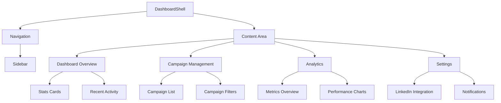
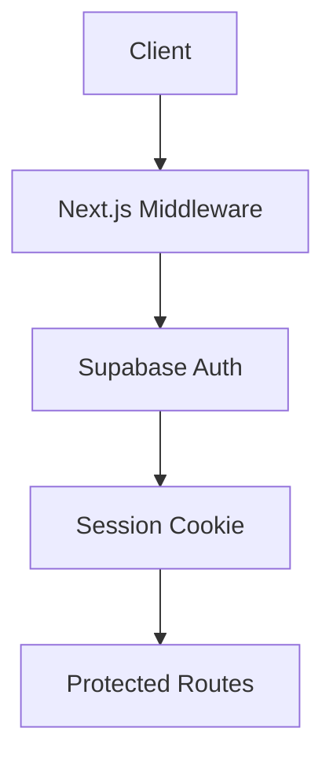
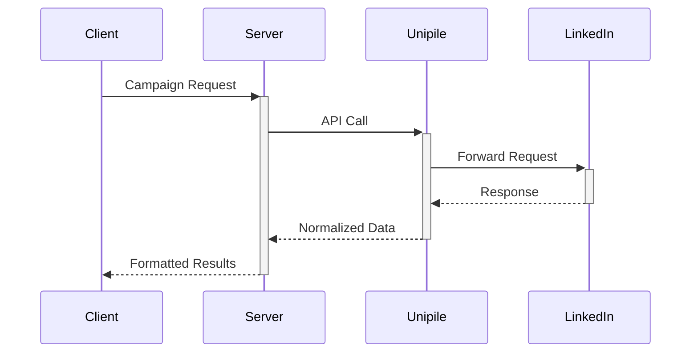

# System Patterns
**Last Updated:** 2024-02-21

## Dashboard Architecture

## Component Patterns
- Dark theme container wrappers
- Responsive grid layouts
- Card-based content blocks
- Real-time metric displays
- Empty state patterns
- Sidebar navigation with icons

## Auth Architecture

## API Rate Limiting
- Redis-backed counters
- Tier-based buckets (Free/Pro)
- Client-side quota display

## LinkedIn Integration

[//]: # (Cross-reference: techContext.md#design-system)
