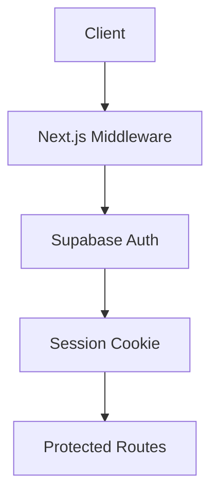
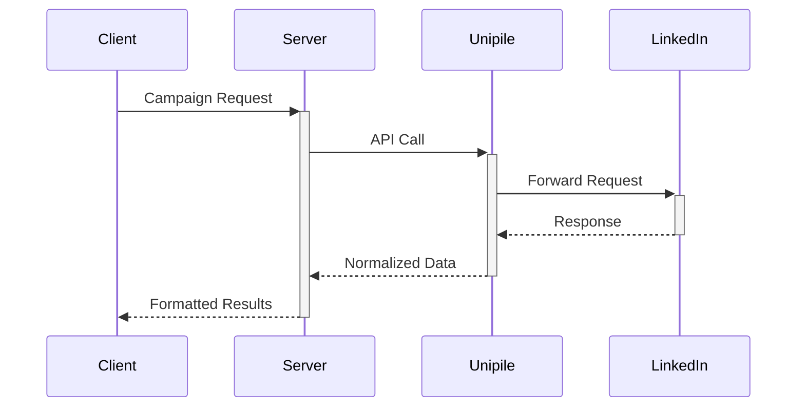

# System Patterns
**Last Updated:** 2024-02-21

## Auth Architecture

## API Rate Limiting
- Redis-backed counters
- Tier-based buckets (Free/Pro)
- Client-side quota display

## LinkedIn Integration

[//]: # (Cross-reference: techContext.md#api-security)
